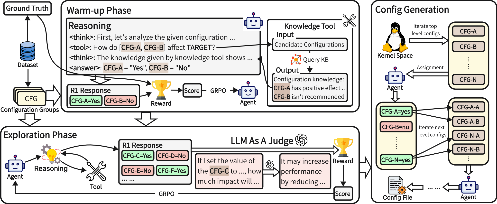

# OS-R1: Agentic Operating System Kernel Tuning with Reinforcement Learning  

Official resources of **"OS-R1: Agentic Operating System Kernel Tuning with Reinforcement Learning"**. [Hongyu Lin](https://arxiv.org/search/cs?searchtype=author&query=Lin,+H), [Yuchen Li](https://arxiv.org/search/cs?searchtype=author&query=Li,+Y), [Haoran Luo](https://arxiv.org/search/cs?searchtype=author&query=Luo,+H), [Kaichun Yao](https://arxiv.org/search/cs?searchtype=author&query=Yao,+K), [Libo Zhang](https://arxiv.org/search/cs?searchtype=author&query=Zhang,+L), [Mingjie Xing](https://arxiv.org/search/cs?searchtype=author&query=Xing,+M), [Yanjun Wu](https://arxiv.org/search/cs?searchtype=author&query=Wu,+Y). [[paper](https://arxiv.org/abs/2503.09663)]

[](https://opensource.org/licenses/Apache-2.0)

## Overview



OS-R1 is an **agentic Linux kernel tuning framework** that leverages reinforcement learning (RL) and large language models (LLMs) for efficient kernel configuration. It introduces a rule-based RL approach to autonomously optimize kernel configurations with minimal training data, improving system performance across diverse workloads.

## Key Features

- **Autonomous Kernel Tuning**: Utilizes RL-based agents to perform kernel tuning with minimal human intervention.
- **Rule-Based Reward System**: Integrates a rule-driven reward function that evaluates configuration validity, performance improvement, and format correctness.
- **Two-Phase Training Pipeline**: Accelerates convergence while maintaining high data efficiency.
- **Generalization Across Workloads**: Adapts to diverse real-world workloads with minimal retraining.

## Environment Setup

**Clone the repository**

```bash
git clone https://github.com/LHY-24/OS-R1.git
cd OS-R1
```

**Install `verl`**

```bash
# Create the conda environment
conda create -n verl python==3.10
conda activate verl

# install verl together with some lightweight dependencies in setup.py
git submodule update --init --recursive
cd verl
pip3 install -e .

# Install the latest stable version of vLLM
pip3 install vllm

# Install flash-attn
pip3 install flash-attn --no-build-isolation
```

**Install LightRAG**

```bash
git clone git@github.com:HKUDS/LightRAG.git
cd LightRAG
git checkout v1.1.1
pip3 install -e .
```

**Install Kconfiglib**

```bash
pip3 install kconfiglib
```

## Training

```bash
# prepare data
mkdir ~/data
cd ~/data
mkdir os_r1
cd os_r1
mkdir os_r1_train
mkdir os_r1_validate
# unzip OS-R1/os_r1_data/train.zip to os_r1_train
# unzip OS-R1/os_r1_data/validate.zip to os_r1_validate

# preprocess data
cd /path/to/OS-R1
python3 examples/data_preprocess/os_r1.py

# start training
bash run_grpo_os_r1.sh
```

## Inference

**Init environment**

```bash
# replace your OpenAI key (and base_url) in Config.py file and init_env.sh
source init_env.sh
```

**Download Linux kernel**

```bash
# downloads linux kernel source code from https://www.kernel.org/pub/linux/kernel/. Use v6.2.16 as an example.
wget https://www.kernel.org/pub/linux/kernel/v6.x/linux-6.2.16.tar.gz
tar -zxf https://www.kernel.org/pub/linux/kernel/v6.x/linux-6.2.16.tar.gz
```

**Initialize the knowledge base**

```python
python3 build_kg.py /path/to/linux/kernel/source_code
```

**Run kernel tuning**

```bash
# place an origin config to linux-6.2.16/.config
cd /path/to/OS-R1/Inference
python3 Inference.py /path/to/linux/kernel -t "Tuning target" --config-path "/path/to/OS-R1/agent_r1/src/config" --config-name "agent_trainer_inference"
```

**Apply configurations**

Move the generated configuration to Linux source code directory and rename it to ".config". Then compile the linux kernel.
```bash
mv config_output /path/to/linux/kernel/source_code/.config
```

## Citation

```tex
@misc{lin2025osr1agenticoperatingkernel,
      title={OS-R1: Agentic Operating System Kernel Tuning with Reinforcement Learning}, 
      author={Hongyu Lin and Yuchen Li and Haoran Luo and Kaichun Yao and Libo Zhang and Mingjie Xing and Yanjun Wu},
      year={2025},
      eprint={2508.12551},
      archivePrefix={arXiv},
      primaryClass={cs.LG},
      url={https://arxiv.org/abs/2508.12551}, 
}
```

## Feedback

Contributions and feedback are greatly appreciated! Whether you've found a bug, have a question, or want to suggest improvements, please open an issue. Your input helps make OS-R1 better for everyone.

For further questions, please contact: hongyu2021@iscas.ac.cn, liyuchen2021@iscas.ac.cn, [haoran.luo@ieee.org](mailto:haoran.luo@ieee.org).

## Acknowledgements

This repo benefits from [AutoOS](https://github.com/xuewuyinhe/AutoOS) , [Agent-R1](https://github.com/0russwest0/Agent-R1/tree/main), and [LightRAG](https://github.com/HKUDS/LightRAG). Thanks for their wonderful works.  
